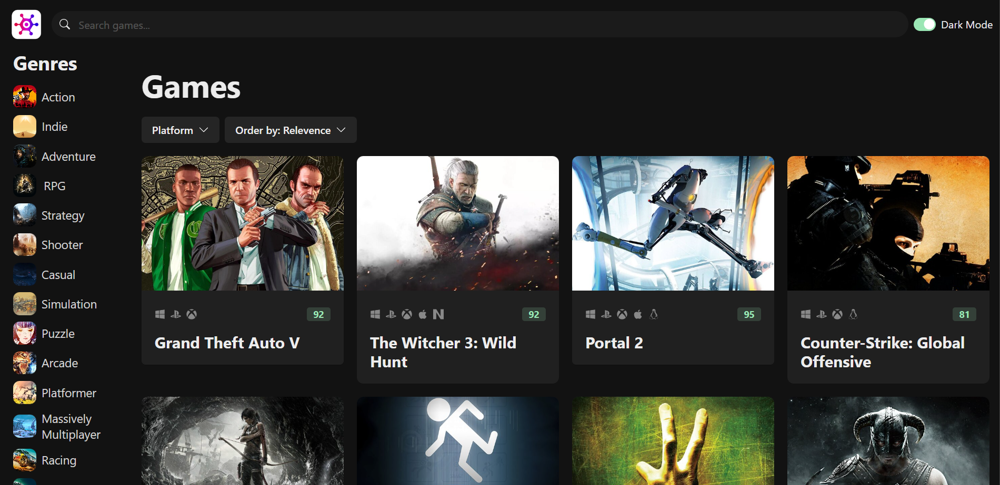

# 🎮 Game Hub – A Game Info Hub  

Game Hub is a web application that allows users to browse, search, and discover games. It provides an intuitive interface for game enthusiasts to find and manage their favorite games.  
The website is accessible at [Game-Hub](https://game-hub-bay-two.vercel.app/)



## ✨ Features  

- 🔍 **Game Search** – Easily find games by name, genre, or rating  
- 📝 **Game Details** – View game descriptions, ratings, and screenshots  
- 🎮 **Responsive Design** – Optimized for all screen sizes  
- 🌙 **Dark/Light Theme Toggle** – Switch between light and dark modes  


## 🛠 Technologies Used  

- **React**
- **Typescript**
- **Chakara UI**  
- **RAWG API** – External API for fetching game details  
- **Vercel** – Deployed for live access  

## 🚀 Getting Started  

To get a local copy of the project up and running, follow these steps:  


### 📥 Installation  

1️⃣ **Clone the repository:**  
```bash
git clone https://github.com/AungPyaeSone1000/Game-Hub.git
cd Game-Hub
```  

2️⃣ **Install dependencies:**  
```bash
npm install
# or
yarn install
```  

3️⃣ **Run the development server:**  
```bash
npm run dev
# or
yarn dev
```  

🔥 Open [http://localhost:3000](http://localhost:3000) in your browser to see the result!  

## 🤝 Contributing  

Contributions are welcome! 🎉 Fork the repository and submit a pull request for any enhancements or bug fixes.  


